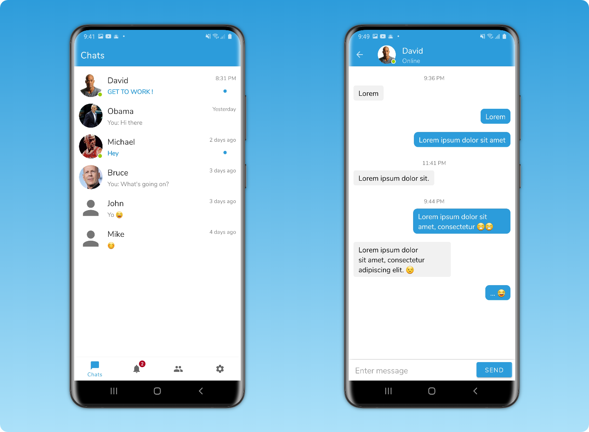
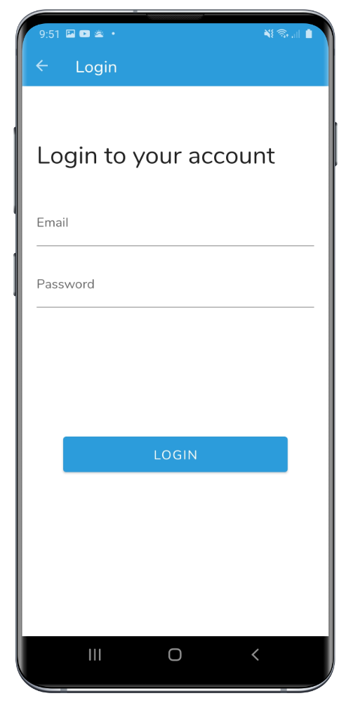
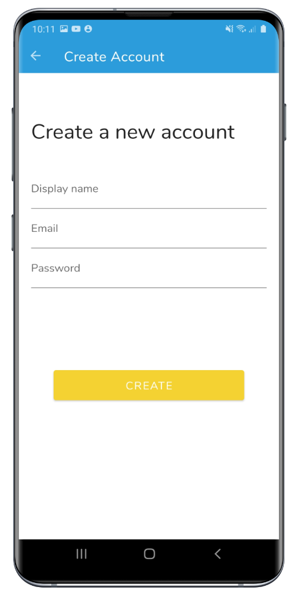
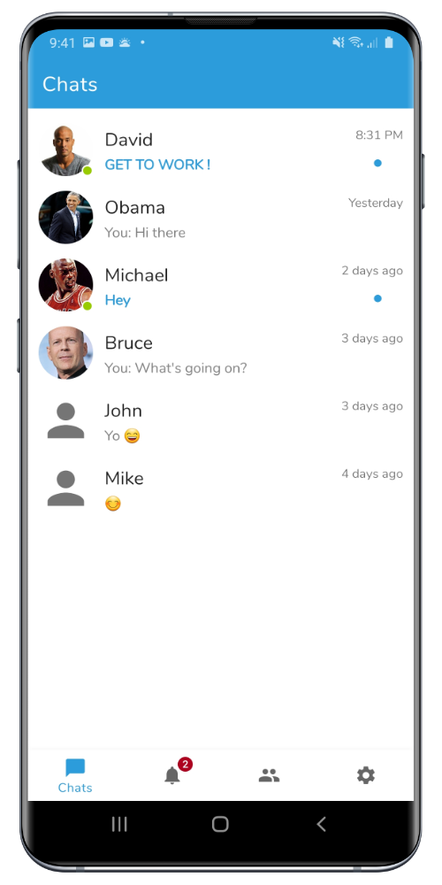
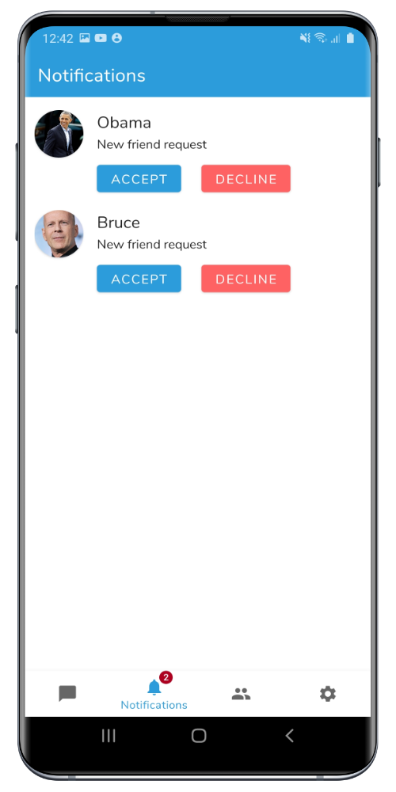
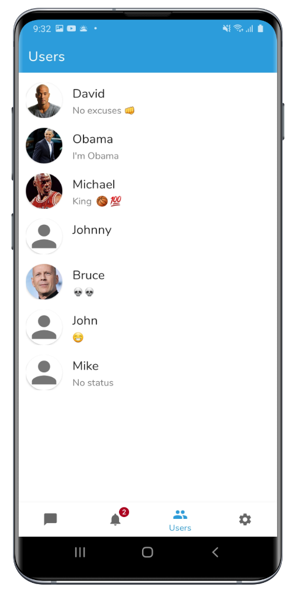
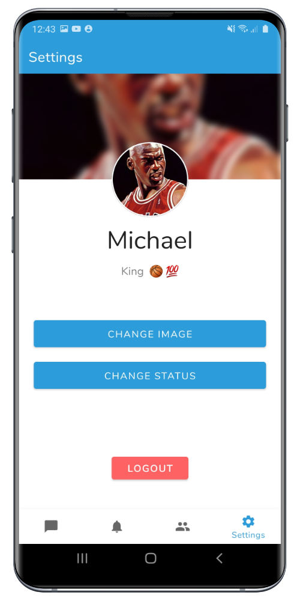
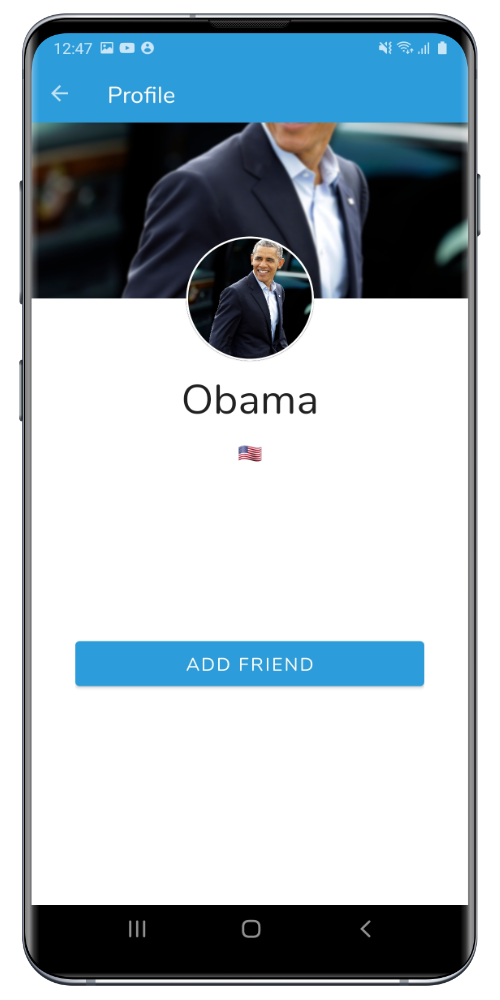
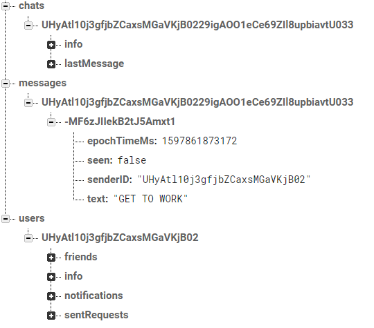

# Chat App Android

## Introduction
This is a demo application built with the goal to create a fun and challenging application based on the MVVM architectural pattern.

See below for more information.

## Technologies & Architecture 

#### Technologies
Android, Kotlin

#### Architecture
Model-View-ViewModel (MVVM)

#### Firebase
* Authentication
* Realtime Database
* Storage

#### Architecture Components
[ViewModel](https://developer.android.com/topic/libraries/architecture/viewmodel), [LiveData](https://developer.android.com/topic/libraries/architecture/livedata), [DataBinding](https://developer.android.com/topic/libraries/data-binding), 
[Navigation](https://developer.android.com/guide/navigation/)

## Features

**Start:** Login/create account

**Chats:** List of chats, online status, update on change

**Notifications:** Accept/decline friend requests, notifications symbol

**Users:** List of users

**Settings:** Change image, change status, logout

**Chat:** Send and show messages sorted by timestamp, online status, custom toolbar, update on change

**Profile:** Add/remove friend, accept/decline friend request

**General:** Auto login, bottom navigation, error messages with snackbar, progress bar

## Screenshots

### Start | Login | Create Account

  
   
   

### Chats | Notifications | Users

  
   
   

### Settings | Chat | Profile

  
   
   

### Firebase

   

## Setup
#### Requirements
* Basic knowledge about Android Studio
* Basic knowledge about Firebase

#### Firebase
 * Setup Authentication and use the Sign-in method 'Email/Password'
 * Setup Realtime Database
 * Setup Storage
 * Replace the file [google-services.json](app/google-services.json)
 * <b>Note:</b> Download the google-services.json file after the Firebase services are set up to automatically include the services in the json file.
 * <b>Note:</b> When updating the google-services.json file then make sure to invalidate the caches as well as doing a clean + rebuild.

#### Project
1. Download and open the project in Android Studio
2. Connect your Android phone or use the emulator to start the application
